# Poltergeist

**The "Performative" OIDC Shim**

Poltergeist is a lightweight, stateless OIDC stub written in Rust. It exists solely to satisfy some tools strict OIDC requirements by bridging an existing Ingress authentication context.

## Overview

* **The Problem:** some tools requires an OIDC Provider (Issuer, Token, JWKS). The corporate Identity Provider refuses to support public clients or the specific claims some tools needs.
* **The Reality:** All traffic arrives via an Ingress Gateway. Requests are *already* authenticated. The Ingress injects the upstream JWT into the `Authorization` header.
* **The Solution:** Poltergeist acts as a "Yes Man." It accepts the upstream header, pretends to perform an OIDC login flow (to satisfy the some tools SPA), and re-signs the upstream identity into a format some tools accepts.

### The "Shim" Flow

```mermaid
sequenceDiagram
    autonumber
    participant User as User (Browser)
    participant Ingress as Ingress Gateway
    participant Poltergeist as Poltergeist (Shim)
    participant Client as Client App (SPA)
    participant Upstream as Upstream IdP

    Note over User, Upstream: 0. Initial Ingress Auth (Standard OIDC)
    User->>Ingress: Access Application URL
    Ingress-->>User: Redirect to Upstream IdP
    User->>Upstream: Authenticate (Login/MFA)
    Upstream-->>User: Redirect back to Ingress
    
    User->>Ingress: GET spa
    Ingress->>Client: Load SPA
    Client->>User: Redirect to Identity Provider (Poltergeist)
    
    User->>Ingress: GET /authorize?...
    Note right of Ingress: 1. Ingress validates User
    Ingress->>Poltergeist: GET /authorize... <br/>(Adds `Authorization: Bearer <Upstream_JWT>`)
    
    rect rgb(45, 45, 45)
    Note over Poltergeist: 2. Shim Logic
    Poltergeist->>Poltergeist: Extract Identity from `Authorization` Header
    Poltergeist->>Poltergeist: Generate `auth_code`
    Poltergeist->>Poltergeist: Store `auth_code` -> `Identity` (in-memory)
    end
    
    Poltergeist-->>User: 302 Found (Location: callback_url?code=xyz)
    
    User->>Client: GET /callback?code=xyz
    Client->>Poltergeist: POST /token (code=xyz...)
    
    rect rgb(45, 45, 45)
    Note over Poltergeist: 3. Token Minting
    Poltergeist->>Poltergeist: Retrieve Identity using `code`
    Poltergeist->>Poltergeist: Sign new JWTs (ID Token, Access Token)
    end
    
    Poltergeist-->>Client: 200 OK (Tokens)
```



## Features

- **Stateless Architecture:** Uses `moka` for high-performance, in-memory caching of auth codes.
- **Configurable:** Driven by a YAML configuration file (`config.yaml`) for issuer URL, port, upstream OIDC settings, and private key location.
- **OIDC Compliant:** Implements standard OIDC endpoints:
    - `/.well-known/openid-configuration`: Returns provider metadata.
    - `/authorize`: Handles the authorization flow, validating upstream tokens (optional) and issuing auth codes.
    - `/token`: Exchanges auth codes for ID and Access tokens signed by Poltergeist.
    - `/jwks`: Exposes the public key for token verification.
- **Upstream Token Validation:** Can optionally validate upstream JWTs against a remote JWKS.
- **Performative Auth Flow:** Seamlessly bridges the existing authentication from the Ingress to some tools's OIDC flow.

## Configuration

The application is configured via `config.yaml`. An example configuration:

```yaml
issuer: "http://localhost:8080"
grant_types_supported:
  - "authorization_code"
  - "client_credentials"
port: 8080
upstream_oidc_url: "http://upstream-idp/auth"
upstream_jwks_url: "http://upstream-idp/.well-known/jwks.json"
validate_upstream_token: false
private_key_path: "test/private_key.pem"
```

## Running the Application

1.  **Generate a Private Key:**
    You need an RSA private key in PKCS#8 PEM format. You can generate one using OpenSSL:
    ```bash
    openssl genpkey -algorithm RSA -out private_key.pem -pkeyopt rsa_keygen_bits:2048
    ```
    Ensure the path to this key is correctly set in `config.yaml` under `private_key_path`.

2.  **Run with Cargo:**
    ```bash
    cargo run
    ```

## Endpoints

-   `GET /.well-known/openid-configuration`: OIDC discovery document.
-   `GET /authorize`: Authorization endpoint.
-   `POST /token`: Token exchange endpoint.
-   `GET /jwks`: JSON Web Key Set endpoint.

## Usage Examples

### 1. Discovery
```bash
curl -s http://localhost:8080/.well-known/openid-configuration | jq
```

### 2. Authorization (Browser Flow Simulation)
To simulate the first step, provide an upstream token in the `Authorization` header:
```bash
# This will return a 303 Redirect with a ?code=... in the Location header
curl -i "http://localhost:8080/authorize?client_id=frontend-app&redirect_uri=http://callback&response_type=code&code_challenge=foo" \
     -H "Authorization: Bearer <YOUR_UPSTREAM_JWT>"
```

### 3. Token Exchange (Authorization Code)
```bash
curl -X POST http://localhost:8080/token \
     -H "Content-Type: application/json" \
     -d '{
       "grant_type": "authorization_code",
       "code": "<CODE_FROM_PREVIOUS_STEP>",
       "client_id": "frontend-app"
     }' | jq
```

### 4. M2M Token (Client Credentials)
```bash
curl -X POST http://localhost:8080/token \
     -H "Content-Type: application/json" \
     -d '{
       "grant_type": "client_credentials",
       "client_id": "backend-service",
       "client_secret": "service-secret"
     }' | jq
```

## Development

-   **Tests:** The project includes a test suite. Run them with:
    ```bash
    cargo test
    ```
    *Note: Some tests may require a valid `private_key.pem` in the `test/` directory.*

## License

[Add License Here]
